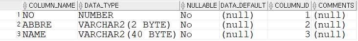

# Readme에서 사용되는 언어 Mark Down 구조이다.
# 1.헤더
## 제목1 h2
### 제목1 h3
#### 제목1 h4
##### 제목1 h5
###### 제목1 h6
# 2. 줄바꿈<br>기능
줄 바꾸기를 할때는 엔터를 2번치고 글자를 쓴다.

해야한다.
엔터 두번을 안치면 다음줄에 있는 글자가 바로
옆으로 붙어버린다.
# 3. 인덱싱(순서있는 목록)
1. 기존에 작성
2. 하는 방법
3. 동일하다.
   1. 하위 메뉴
   2. 두번째메뉴
# 순서 없는 목록
* 아이템1
* 아이템2
* 아이템3
___
    * 하위아이템
    * 1
    * 2

 # 4.구분선
___
***

# 5. 코드블록
```
public static void manin(String[] args){
  system.out.println("HELLO");
}
```

# 6. 하이퍼링크(hyper link)
네이버<www.naver.com>

[네이버](www.naver.com)

# 이미지
첫번째 방법: 

두번째방법: 


 
  
  
